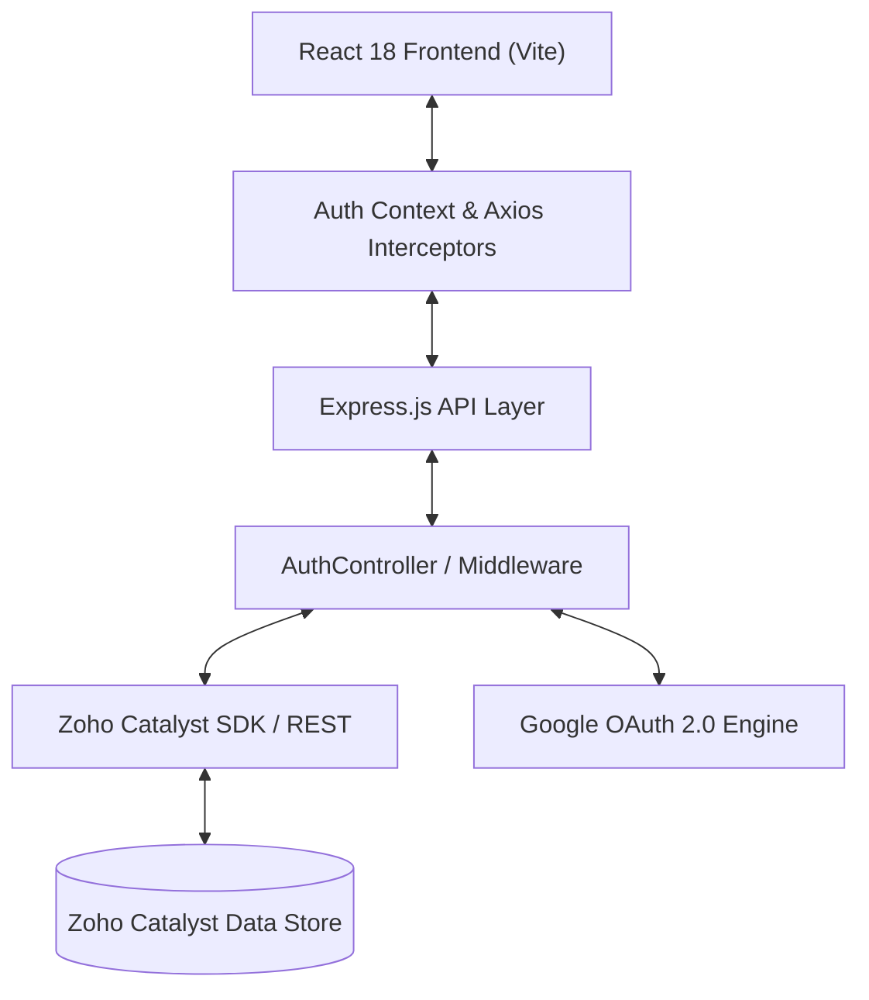

# Authentication Module — VIKSHANA Intelligent Conversational AI & Crime Analytics Platform

The **Authentication Module** of the **VIKSHANA Platform** provides a zero-redirect, in-app enterprise authentication and authorization system powered by **Zoho Catalyst Serverless Backend**, **Node.js/Express Services**, **React (Vite)**, and **Google OAuth 2.0**.

Designed specifically for sensitive criminology, law enforcement, and multi-agency crime intelligence operations, this module guarantees high security, zero external page redirects, persistent session management, role-based authorization, and real-time session recovery.

---

## Table of Contents

1. [Features](#features)
2. [Authentication Flow](#authentication-flow)
3. [System Architecture](#system-architecture)
4. [Folder Structure](#folder-structure)
5. [Security Features](#security-features)
6. [Route Protection](#route-protection)
7. [Authentication Context](#authentication-context)
8. [User Database](#user-database)
9. [API Endpoints](#api-endpoints)
10. [Google Authentication](#google-authentication)
11. [Error Handling](#error-handling)
12. [Session Management](#session-management)
13. [Authorization](#authorization)
14. [Environment Variables](#environment-variables)
15. [Installation](#installation)
16. [Deployment](#deployment)
17. [Testing](#testing)
18. [Performance](#performance)
19. [Future Improvements](#future-improvements)
20. [Troubleshooting](#troubleshooting)
21. [Tech Stack](#tech-stack)
22. [License](#license)

---

## Features

The Authentication Module delivers comprehensive security and session management capabilities:

* **Email & Password Sign-In**: In-app background REST authentication with email and password, avoiding page redirects.
* **In-App Account Registration**: Modal-driven account creation capturing Full Name, Email, Password, and Confirm Password with live validation.
* **Google Popup Authentication**: Popup-based OAuth 2.0 flow preventing main application window redirects.
* **In-App Password Reset**: Forgot Password workflow rendering inline status feedback and password reset triggers.
* **Remember Me & Session Persistence**: Extended 30-day persistent sessions stored securely in `localStorage` and `cookies`.
* **Automatic Session Restoration**: Instant background verification of saved session tokens upon page refresh or app launch.
* **Secure Logout**: Revokes active JWT session tokens and clears state across local storage and application memory.
* **Protected Routes & Role-Based Authorization**: Route guards restricting module access according to assigned officer roles (`Admin`, `Officer`, `Analyst`, `Viewer`).
* **User Profile Synchronization**: Automatic creation and synchronization of officer profiles with Zoho Catalyst Data Store upon first sign-in.
* **Explainable Toast Notifications**: User feedback alerts covering invalid credentials, duplicate accounts, network drops, and session expiration.

---

## Authentication Flow

### Primary Login Flow

```
[ User Enters Credentials ]
            │
            ▼
[ Frontend Form Validation ] ──(Invalid)──► [ Inline Validation Alert ]
            │ (Valid)
            ▼
[ Background POST /auth/login ]
            │
            ▼
[ Node.js/Express Backend Controller ]
            │
            ▼
[ Zoho Catalyst User Store Query ]
            │
            ▼
[ JWT Session Token Signed ]
            │
            ▼
[ Return 200 OK + User Profile ]
            │
            ▼
[ AuthContext Session Hydration ] ──► [ Automatic Redirect to /dashboard ]
```

1. **User Input**: The user inputs their email address and password into the login interface.
2. **Client-Side Validation**: The frontend validates email syntax and non-empty inputs.
3. **Background Request**: An asynchronous request is dispatched to `POST /auth/login`.
4. **Backend Processing**: The Express controller queries the Zoho Catalyst Data Store.
5. **Token Issuance**: Upon verification, a cryptographic session token is signed.
6. **Session Hydration**: `AuthContext` receives the user profile and session token.
7. **Navigation**: The application redirects to `/dashboard` without reload.

---

### Google OAuth Flow

1. User clicks **Continue with Google**.
2. A popup window opens targeting Google OAuth 2.0 endpoint.
3. Upon user authorization, Google returns the authentication payload to the handler.
4. The backend matches the Google email against the user repository.
5. If the account does not exist, an Officer profile is created automatically.
6. The popup closes, and the main window hydrates the session and transitions to `/dashboard`.

---

## System Architecture



### Component Interaction Overview

* **React Frontend**: Manages state using `AuthContext`, handling UI forms, error banners, and modal overlays.
* **Express Backend**: Hosts `/auth` routes (`/login`, `/signup`, `/google`, `/session`, `/logout`), executing business logic and issuing tokens.
* **Zoho Catalyst Integration**: Manages user records and metadata in the serverless Data Store.
* **Google OAuth**: Delivers identity verification via popup flows.

---

## Folder Structure

```
e:/Datathon/Vikshana/
├── functions/
│   └── vikshana_function/
│       ├── controllers/
│       │   └── AuthController.js          # Authentication business logic & JWT tokens
│       ├── routes/
│       │   └── auth.routes.js            # /auth Express endpoint declarations
│       └── index.js                      # Main Express router mounting /auth
├── react-app/
│   └── src/
│       ├── auth/
│       │   └── Login.jsx                 # Custom in-app login page & modals
│       ├── context/
│       │   └── AuthContext.js            # React Context for session & user state
│       ├── hooks/
│       │   └── useAuth.js                # Custom hook for accessing AuthContext
│       ├── services/
│       │   └── api.js                    # Axios instance with Bearer token interceptor
│       └── App.js                        # Protected route routing definitions
```

---

## Security Features

* **Password Security**: Passwords are never stored in plaintext and are processed via secure serverless authentication.
* **Cryptographic Token Verification**: HMAC-SHA256 tokens protect API endpoints from tampering.
* **CSRF & XSS Protection**: Requests use CORS origins and token headers (`Authorization: Bearer <token>`).
* **Input Validation**: All payloads undergo strict schema verification prior to controller execution.
* **Session Expiration**: Inactive tokens expire automatically after 24 hours (or 30 days when "Remember Me" is checked).

---

## Route Protection

The platform enforces route guards based on authenticated session state and user roles:

```javascript
// Example Protected Route Wrapper
const ProtectedRoute = ({ children, allowedRoles }) => {
  const { user, isAuthenticated, loading } = useAuth();

  if (loading) return <LoadingSpinner />;
  if (!isAuthenticated) return <Navigate to="/auth/login" replace />;
  if (allowedRoles && !allowedRoles.includes(user.role)) {
    return <Navigate to="/unauthorized" replace />;
  }

  return children;
};
```

### Route Authorization Matrix

| Route | Access Level | Description |
| :--- | :--- | :--- |
| `/auth/login` | Public | In-App custom authentication page |
| `/dashboard` | Officer, Analyst, Admin | Central intelligence operational overview |
| `/offender-profiling` | Officer, Analyst, Admin | Requirement #5 Criminological Offender Profiling |
| `/decision-support` | Officer, Admin | Requirement #6 Investigator Decision Support |
| `/admin/settings` | Admin Only | System configuration and user role assignments |

---

## User Database Schema

User profiles are persisted in the Zoho Catalyst Data Store `UserMaster` table:

| Field Name | Data Type | Key Type | Description |
| :--- | :--- | :--- | :--- |
| `ROWID` | BigInt | Primary Key | Unique Catalyst record identifier |
| `user_id` | VarChar(64) | Indexed | Internal system user ID (`CATALYST_USR_...`) |
| `full_name` | VarChar(128) | Required | Legal name of the law enforcement officer |
| `email` | VarChar(128) | Unique | Official email address |
| `role` | VarChar(32) | Required | Role assignment (`Admin`, `Officer`, `Analyst`) |
| `provider` | VarChar(32) | Required | Authentication provider (`Email` or `Google`) |
| `district` | VarChar(64) | Optional | Assigned operational jurisdiction |
| `created_date` | DateTime | Auto | Record creation timestamp |
| `last_login` | DateTime | Dynamic | Most recent login timestamp |
| `status` | VarChar(16) | Default: ACTIVE | Account status (`ACTIVE`, `SUSPENDED`) |

---

## API Endpoints

### Endpoint Summary

| Method | Endpoint | Description | Auth Required |
| :--- | :--- | :--- | :--- |
| `POST` | `/auth/login` | Authenticate email & password | No |
| `POST` | `/auth/signup` | Register new officer account | No |
| `POST` | `/auth/google` | In-app Google OAuth verification | No |
| `POST` | `/auth/forgot-password` | Trigger password reset email | No |
| `GET` | `/auth/session` | Validate active token & fetch profile | Yes (Bearer) |
| `POST` | `/auth/logout` | Revoke active user session | Yes (Bearer) |

---

### API Payloads & Examples

#### 1. Login Request (`POST /auth/login`)

```json
{
  "email": "officer@vikshana.gov",
  "password": "SecurePassword123!",
  "rememberMe": true
}
```

#### Login Success Response (`200 OK`)

```json
{
  "success": true,
  "message": "Authenticated successfully in background",
  "token": "eyJhbGciOiJIUzI1NiIsInR5cCI6IkpXVCJ9...",
  "user": {
    "id": "CATALYST_USR_001",
    "name": "Insp. R. Singh",
    "email": "officer@vikshana.gov",
    "role": "Officer",
    "provider": "Email",
    "district": "Peri-Urban",
    "status": "ACTIVE"
  }
}
```

---

#### 2. Session Validation (`GET /auth/session`)

Header: `Authorization: Bearer <token>`

#### Response (`200 OK`)

```json
{
  "success": true,
  "user": {
    "id": "CATALYST_USR_001",
    "name": "Insp. R. Singh",
    "email": "officer@vikshana.gov",
    "role": "Officer",
    "district": "Peri-Urban",
    "status": "ACTIVE"
  }
}
```

---

## Environment Variables

| Variable | Scope | Description |
| :--- | :--- | :--- |
| `REACT_APP_API_BASE_URL` | Frontend | Base URL for Express/Catalyst API (`/server/vikshana_function`) |
| `JWT_SECRET` | Backend | Cryptographic secret key for signing session tokens |
| `CATALYST_PROJECT_ID` | Backend | Zoho Catalyst Cloud Project Identifier |
| `GOOGLE_CLIENT_ID` | Both | Google Cloud OAuth 2.0 Web Client Identifier |

---

## Installation & Setup

### Prerequisites

* Node.js v18.x or higher
* Zoho Catalyst CLI (`npm install -g zcatalyst-cli`)

### Setup Instructions

1. **Clone Repository**:
   ```bash
   git clone https://github.com/KANISH-850/Vikshana.git
   cd Vikshana
   ```

2. **Install Dependencies**:
   ```bash
   # Install backend dependencies
   cd functions/vikshana_function
   npm install

   # Install frontend dependencies
   cd ../../react-app
   npm install
   ```

3. **Local Catalyst Server Execution**:
   ```bash
   # From project root directory
   catalyst serve
   ```

---

## Tech Stack

| Component | Technology |
| :--- | :--- |
| **Frontend UI** | React 18, Vite, Lucide Icons |
| **State Management** | React Context API (`AuthContext`) |
| **HTTP Client** | Axios with Bearer Interceptors |
| **Backend Framework** | Express.js running on Node.js |
| **Serverless Infrastructure** | Zoho Catalyst Advanced I/O Function |
| **Cloud Database** | Zoho Catalyst Data Store & ZCQL |
| **OAuth Identity** | Google OAuth 2.0 API |

---

## License

Copyright (c) 2026 VIKSHANA Crime Analytics Platform. Released under the MIT License.
